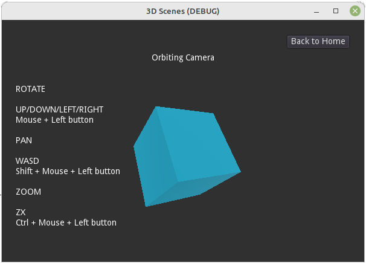

# Godot Scene Templates

A growing collection of useful scene templates for the Godot Game Engine.

For each category (2D/3D), a Home scene is provided to give a menu to navigate to the various example scenes.

You can download or clone this repository to your PC to try them out.

## [2D Scenes](2d)

This is demo project that may be imported into Godot.

- ConfirmQuit - Popup asks for confirmation when quitting without saving
- FileMenu - File Menu with example backend code and File Dialog
- Graph - Example using the GraphEdit node with Graph nodes. [Tutorial](https://gdscript.com/solutions/godot-graphnode-and-graphedit-tutorial/)

## [3D Scenes](3d)
<<<<<<< HEAD
- OrbitingCamera - Node Tree for easy orbiting of a Camera around a pivot point
=======

This is also a demo project that may be imported into Godot.

- OrbitingCamera - Node Tree for easy orbiting of a Camera around a point using the mouse or keyboard

>>>>>>> 1aa61c7bdbb7412f6b9a520c5243deaac970d664

---
Encourage me to do more: [Buy me a coffee](https://buymeacoffee.com/gdscriptdude)

See also: [GDScript Examples](https://github.com/andrew-wilkes/gdscript-examples)